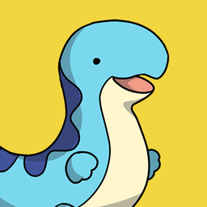

<table style="width:100%" align="center" border="0">
  <tr align="center">
    <td></td>
    <td><h1>🐉 ＰａｌＷｅｅｄ 🔥</h1></td>
  </tr>
</table>

  <strong>🐲 PalWeed is a Docker container to help you get started with hosting your own <a href="https://www.pocketpair.jp/palworld">Palworld</a> dedicated server. 🐦‍🔥</strong>

  
  
  
  
  

